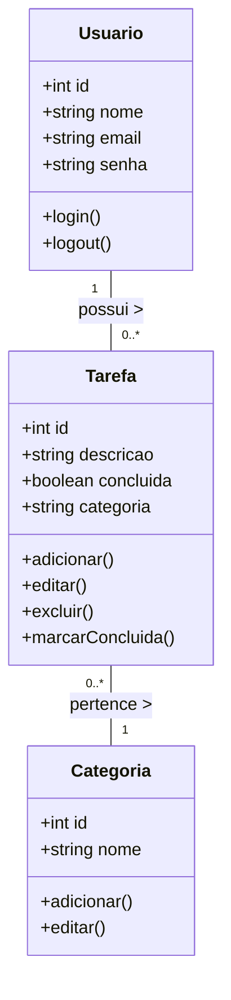
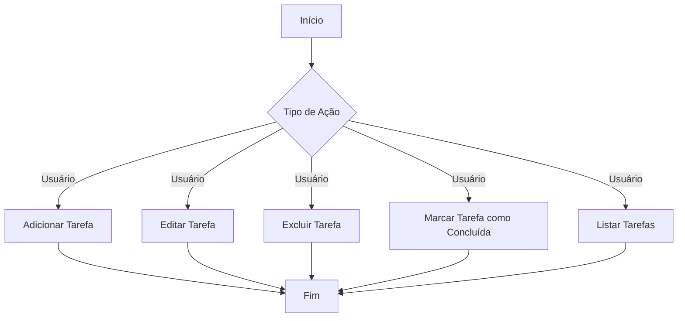
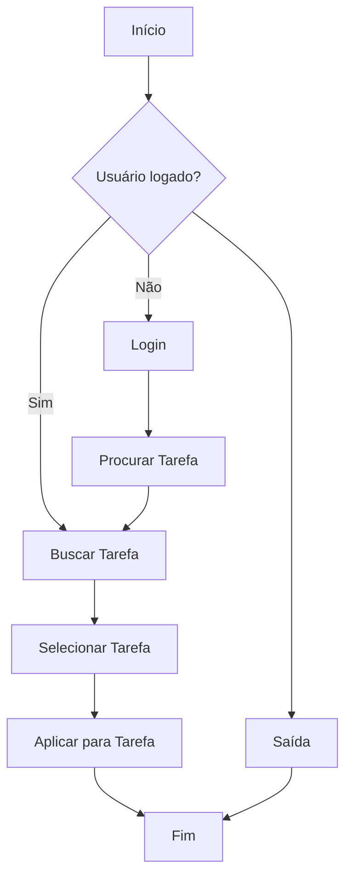

# Projeto Formativa

### **1. O que Vamos Fazer**

Nesta seção, descrevemos o objetivo principal do projeto: criar uma aplicação web de To-Do List. A aplicação permitirá aos usuários gerenciar suas tarefas de forma eficiente, com funcionalidades para adicionar, editar, excluir e organizar tarefas, bem como uma interface intuitiva para uma experiência de usuário fluida.

---

### **2. Escopo Funcional**

**O que o sistema deve fazer:**

1. **Cadastro de Usuários:**
    - **Funcionalidade:** Permitir que usuários criem contas, façam login e gerenciem seus perfis.
    - **Detalhe:** O perfil incluirá informações pessoais, configurações de preferências, e foto de perfil.
    - **Diagrama:** Adicione um **Diagrama de Caso de Uso** mostrando o processo de cadastro e login.
2. **Gerenciamento de Tarefas:**
    - **Funcionalidade:** Usuários podem adicionar, editar, visualizar e excluir tarefas.
    - **Detalhe:** Cada tarefa pode incluir título, descrição, data de vencimento, e status de conclusão.
    - **Diagrama:** Adicione um **Diagrama de Classes** mostrando a estrutura dos dados de uma tarefa.
3. **Organização de Tarefas:**
    - **Funcionalidade:** Permitir a organização de tarefas por categorias ou tags.
    - **Detalhe:** Usuários podem criar e gerenciar categorias e tags para organizar suas tarefas.
    - **Diagrama:** Adicione um **Diagrama de Classes** mostrando a estrutura dos dados de categorias e tags.
4. **Busca e Filtro de Tarefas:**
    - **Funcionalidade:** Usuários podem buscar tarefas utilizando filtros como data, prioridade, e status.
    - **Detalhe:** A busca deve ser rápida e os resultados apresentados de forma intuitiva.
    - **Diagrama:** Adicione um **Diagrama de Fluxo** mostrando o processo de busca e filtragem de tarefas.
5. **Notificações:**
    - **Funcionalidade:** Notificar os usuários sobre tarefas próximas do prazo e atualizações importantes.
    - **Detalhe:** As notificações devem ser enviadas por e-mail ou através da interface da aplicação.
    - **Diagrama:** Adicione um **Diagrama de Fluxo** mostrando o processo de envio de notificações.

---

### **3. Escopo Não Funcional**

**Como o sistema deve desempenhar as funções:**

1. **Performance:**
    - **Requisitos:** O sistema deve responder rapidamente às interações do usuário, com tempo de resposta inferior a 2 segundos.
    - **Detalhe:** A arquitetura deve suportar uma alta carga de usuários simultâneos.
    - **Imagem:** Adicione gráficos de benchmarks de sistemas similares.
2. **Segurança:**
    - **Requisitos:** Dados pessoais e senhas devem ser armazenados de forma criptografada.
    - **Detalhe:** Implementação de autenticação de dois fatores para acesso ao sistema.
    - **Imagem:** Inclua um diagrama de segurança mostrando o fluxo de autenticação.
3. **Usabilidade:**
    - **Requisitos:** A interface do sistema deve ser intuitiva e fácil de usar, com design responsivo para dispositivos móveis.
    - **Detalhe:** Realizar testes de usabilidade para garantir a facilidade de navegação.
    - **Imagem:** Adicione capturas de tela ou mockups das interfaces.
4. **Escalabilidade:**
    - **Requisitos:** O sistema deve ser escalável para suportar crescimento futuro, tanto em termos de usuários quanto de funcionalidades.
    - **Detalhe:** Uso de arquitetura baseada em microserviços para facilitar a escalabilidade.
    - **Imagem:** Inclua um diagrama de arquitetura que demonstre a escalabilidade do sistema.

---

### **4. Objetivos SMART**

- **S** (Específico): Desenvolver uma aplicação web de To-Do List com funcionalidades de gerenciamento, organização, e notificação de tarefas.
- **M** (Mensurável): Concluir o desenvolvimento da aplicação em 6 meses com todas as funcionalidades principais implementadas e testadas.
- **A** (Alcançável): Utilizar tecnologias web como React, Node.js, MongoDB, e JWT para construir o sistema.
- **R** (Relevante): Atender à demanda por uma solução eficiente de gerenciamento de tarefas.
- **T** (Temporal): Lançar a versão beta da aplicação até o final do segundo trimestre de 2024.

---

### **5. Cronograma**

**Fase 1: Planejamento e Análise (1 mês)**

- **Tarefas:** Definição de requisitos, análise de riscos, e planejamento do projeto.
- **Ferramenta:** Adicione um **Diagrama de Gantt** com as atividades.

**Fase 2: Design e Protótipos (2 meses)**

- **Tarefas:** Criação de wireframes, protótipos e design da interface.
- **Imagem:** Inclua imagens dos protótipos.

**Fase 3: Desenvolvimento (3 meses)**

- **Tarefas:** Implementação do sistema, integração com banco de dados, e desenvolvimento das funcionalidades principais.
- **Ferramenta:** Atualize o **Diagrama de Gantt** com o progresso.

**Fase 4: Testes e Ajustes (1 mês)**

- **Tarefas:** Testes de unidade, integração, usabilidade, e segurança.
- **Imagem:** Inclua gráficos de resultados dos testes.

**Fase 5: Lançamento (1 mês)**

- **Tarefas:** Preparação do ambiente de produção, deploy, e lançamento.
- **Imagem:** Adicione uma imagem ou gif celebrando o lançamento.

---

### **6. Análise de Risco**

**Riscos Potenciais e Mitigações:**

1. **Atraso no Desenvolvimento:**
    - **Impacto:** Atraso no cronograma e no lançamento.
    - **Mitigação:** Revisão constante do cronograma e alocação de recursos extras se necessário.
    - **Imagem:** Adicione uma matriz de risco.
2. **Problemas de Segurança:**
    - **Impacto:** Vazamento de dados e perda de confiança dos usuários.
    - **Mitigação:** Implementação rigorosa de boas práticas de segurança e auditorias regulares.
    - **Imagem:** Inclua um diagrama mostrando as práticas de segurança.
3. **Baixa Adoção pelo Mercado:**
    - **Impacto:** Falha no lançamento e baixo retorno sobre investimento.
    - **Mitigação:** Realizar campanhas de marketing e coletar feedback constante dos usuários.
    - **Imagem:** Adicione gráficos de possíveis estratégias de marketing.

---

### **7. Recursos**

**Recursos Necessários:**

1. **Tecnologias:**
    - **Frontend:** React.js, HTML, CSS
    - **Backend:** Node.js, Express.js
    - **Banco de Dados:** MongoDB
    - **Infraestrutura:** AWS ou Azure
    - **Imagem:** Adicione logotipos das tecnologias usadas.
2. **Orçamento:**
    - **Detalhe:** Alocação de orçamento para desenvolvimento, infraestrutura, e marketing.
    - **Imagem:** Inclua gráficos de alocação de orçamento.

---

### **8. Equipe do Projeto**

A equipe do projeto é fundamental para o sucesso de qualquer empreendimento de software. A equipe será composta por profissionais com diferentes habilidades e responsabilidades.

**1. Gerente de Projetos**

- **Responsabilidades:** Coordenar a equipe, gerenciar prazos e garantir que o projeto esteja alinhado com os objetivos e cronogramas estabelecidos.
- **Habilidades:** Excelente organização, habilidades de comunicação e experiência em gerenciamento de projetos ágeis (Scrum, Kanban).
- **Imagem:** Inclua uma foto ou avatar do gerente de projetos e um gráfico de tarefas e milestones sob sua responsabilidade.

**2. Desenvolvedores Frontend**

- **Responsabilidades:** Implementar a interface do usuário usando tecnologias como React.js, HTML, e CSS.
- **Habilidades:** Proficiência em JavaScript, frameworks de frontend, e um bom entendimento de design de UI/UX.
- **Imagem:** Adicione fotos ou avatares dos desenvolvedores frontend e exemplos de interfaces ou componentes criados por eles.

**3. Desenvolvedores Backend**

- **Responsabilidades:** Desenvolver e manter a lógica de negócios do sistema, construir APIs, e integrar o banco de dados com o frontend.
- **Habilidades:** Proficiência em Node.js, Express.js, MongoDB, e conhecimentos de segurança em aplicações web.
- **Imagem:** Adicione fotos ou avatares dos desenvolvedores backend e exemplos de arquitetura ou código backend.

**4. Designer de UX/UI**

- **Responsabilidades:** Criar wireframes, mockups, e o design visual da interface do sistema.
- **Habilidades:** Experiência em ferramentas de design como Figma, Adobe XD, e um forte entendimento de psicologia do usuário.
- **Imagem:** Inclua uma imagem do designer de UX/UI e exemplos de designs ou protótipos criados.

**5. Analista de Qualidade (QA)**

- **Responsabilidades:**
    - Testar o sistema para identificar bugs, falhas de segurança, e problemas de usabilidade.
    - Criar planos de teste e garantir que todas as funcionalidades do sistema estejam funcionando conforme esperado antes do lançamento.
- **Habilidades:**
    - Conhecimento em técnicas de teste, automação de testes, e ferramentas de controle de qualidade.
- **Imagem:** Adicione uma imagem do analista de QA e gráficos ou relatórios de testes realizados.

### **6. Especialista em DevOps**

- **Responsabilidades:**
    - Configurar e gerenciar a infraestrutura do projeto, garantindo que o ambiente de desenvolvimento e produção esteja estável e eficiente.
    - Implementar pipelines de CI/CD para facilitar deploys rápidos e confiáveis.
- **Habilidades:**
    - Experiência com plataformas de nuvem (AWS, Azure), Docker, Kubernetes, e ferramentas de automação.
- **Imagem:** Inclua uma imagem do especialista em DevOps e diagramas ou fluxos de deploy criados.

### **7. Especialista em Segurança da Informação**

- **Responsabilidades:**
    - Proteger o sistema contra ameaças de segurança, implementando criptografia, controle de acesso e monitoramento de vulnerabilidades.
    - Realizar auditorias de segurança e fornecer relatórios de conformidade.
- **Habilidades:**
    - Conhecimento avançado em segurança de aplicações, criptografia, e regulamentações como GDPR.
- **Imagem:** Adicione uma imagem do especialista em segurança e exemplos de medidas de segurança implementadas.

### **8. Especialista em Marketing Digital**

- **Responsabilidades:**
    - Planejar e executar campanhas de marketing para promover o sistema, aumentar a visibilidade e atrair usuários.
    - Analisar o mercado e ajustar estratégias para alcançar o público-alvo.
- **Habilidades:**
    - Conhecimento em SEO, marketing de conteúdo, gestão de mídias sociais, e análise de dados de mercado.
- **Imagem:** Inclua uma imagem do especialista em marketing e gráficos de campanhas ou estratégias de marketing.

---

## 9. Diagramas

1. Classe

1. Uso

1. Fluxo

**Baixo:**

**Médio:**

